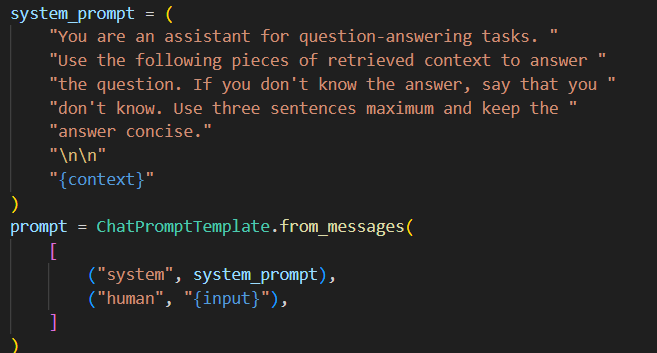

# Taller LangChain RAG 

Este proyecto implementa un sistema de Pregunta-Respuesta (QA) que combina recuperación de información y generación de respuestas. Utiliza una arquitectura conocida como Retrieval-Augmented Generation (RAG) para proporcionar respuestas precisas basadas en  los documentos que le proporcionemos ampliando el conocimieto del LLM. Los pasos principales son: cargar los datos, dividirlos en fragmentos, almacenarlos en un vectorstore, recuperarlos de manera eficiente y luego generar una respuesta usando un modelo de lenguaje potente como GPT-4.

Este proyecto implementa el tutorial [LangChain RAG](https://python.langchain.com/docs/tutorials/rag/),

## ⚙️ Arquitectura 
## Arquitectura del Sistema

### 1. **Carga de Contenido**
   - **Componente**: `WebBaseLoader`
   - **Función**: Carga y extrae contenido relevante de una página web (por ejemplo, un artículo de blog), utilizando BeautifulSoup para filtrar solo la información necesaria (títulos, encabezados, contenido).

### 2. **Fragmentación/ Dividir**
   - **Componente**: `RecursiveCharacterTextSplitter`
   - **Función**: Divide el contenido en fragmentos pequeños para facilitar su procesamiento. En el ejemplo divide  el texto en fragmentos de 1000 caracteres con superposición de 200 caracteres para preservar el contexto.

### 3. **Indexación y Almacenamiento**
   - **Descripción**: Convierte los fragmentos en vectores matemáticos y los almacena en una base de datos optimizada.
   - **Componente**: `Chroma` (con `OpenAIEmbeddings`)
   - **Función**: Convierte los fragmentos de texto en vectores matemáticos usando  OpenAI Embeddings de OpenAI y los almacena en la base de datos `Chroma`.

### 4. **Recuperación**
   - **Componente**: `Retriever`
   - **Función**: Cuando se hace una pregunta se relaliza  la búsqueda en la base de datos de vectores para recuperar los fragmentos de texto más relevantes.

### 5. **Generación de Respuestas**
   - **Componente**: `ChatOpenAI` (GPT-4)
   - **Función**: El modelo de lenguaje (GPT-4) toma los fragmentos relevantes recuperados y genera una respuesta a la consulta utilizando esos fragmentos como contexto. Se utiliza un prompt que guía al modelo para que elabore una respuesta concisa y útil basándose en el   contexto recuperado por ejemplo que responda "don't know" si no sabe la respuesta.
   - 


### 6. **Formateo**
   - **Componente**: `StrOutputParser`
   - **Función**: La respuesta generada se formatea para presentarla de manera clara al usuario.


## 🚀Empezando

### Requisitos Previos

Para ejecutar este proyecto, necesitarás tener instalado:

- Python.
- Un IDE de Python de su preferencia.
- Un navegador web para interactuar con el servidor y la API.

### Instalación

1. Tener instalado Git en tu máquina local.
2. Elegir una carpeta en donde guardar el proyecto.
3. Abrir la terminal de GIT (click derecho y seleccionar "Git bash here").
4. Clonar el repositorio en tu máquina local:lic dere
   ```bash
   https://github.com/Medina95/LangChain-RAG.git
5. Instalar un ambiente virtual de python, para que jupyter notebook pueda correr todas las dependencias

6. Proporcione la API Key en las variables que se encuentran vacias sobre el archivo rag.py

   


### Deployment

1. Abre el proyecto con tu IDE favorito o navega hasta el directorio del proyecto.
2. Ejecute todos los comandos del archivo jupyter Notebook 

4. Desde la terminal, ejecuta los dos archivos de python
     ```bash
   python rag.py

5. Finalmente, puedes interactuar con la aplicación  preguntandole  cosas que tengan que ver con el documento https://lilianweng.github.io/posts/2023-06-23-agent/  en la linea `response = rag_chain.invoke({"input": "tu pregunta"})`:  

   - 
   - 
   - 
   
### Built with
- [Python](https://www.python.org)
- [Jupyter](https://jupyter.org/)

## Authors

* **Carolina Medina Acero** -  [Medina95](https://github.com/Medina95)
